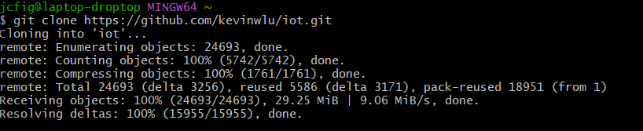

# Lab2 

---
## **Command Line Lab** 

This lab introduces basic Linux command-line operations and Git repository management, focusing on file manipulation, system information commands, and network utilities to familiarize users with essential IoT development and troubleshooting tools.

---

# This lab was running different linux commands
- env, cd, ls, hostname, cat, ifconfig, ping, and netstat I used all of the time during my co-op

---

1. **`hostname`**  
   - Displays the name of the device or system currently being used.
     

2. **`env`**  
   - Lists all environment variables and their values for the current session.

3. **`cd`**  
   - Changes the current working directory. Use it to navigate into folders, go back a level, or return to the home directory.

4. **`ls`**  
   - Lists the contents of the current directory, including files and subdirectories.

5. **`cat [filename]`**  
   - Displays the contents of a specified file directly in the terminal.

6. **`ifconfig`**  
   - Shows information about network interfaces, including IP addresses and network configurations.

7. **`ping [address]`**  
   - Sends packets to a specific address to test connectivity and measure response times.

8. **`netstat`**  
   - Displays information about active network connections and their status.

---

## **Commands that I haven't used often**

1. **`df`**  
   - Displays information about disk space usage. Use the `-h` option to show output in human-readable format, like GB or MB.

2. **`mkdir`**  
   - Creates a new directory.

3. **`nano`**  
   - Opens a text editor to create or edit files.

4. **`cp [original file] [new file]`**  
   - Copies a file to a new location or with a new name.

5. **`mv [file1] [file2]`**  
   - Moves or renames a file.

6. **`rm [file]`**  
   - Deletes a file permanently.

7. **`clear`**  
   - Clears the terminal screen.

8. **`man [command name]`**  
   - Displays the manual page for a command, explaining its usage and options.

9. **`uname`**  
   - Displays system information such as OS, kernel version, and architecture.

---
