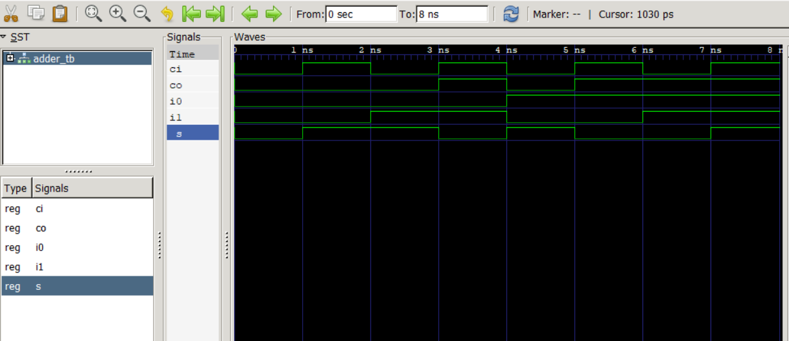
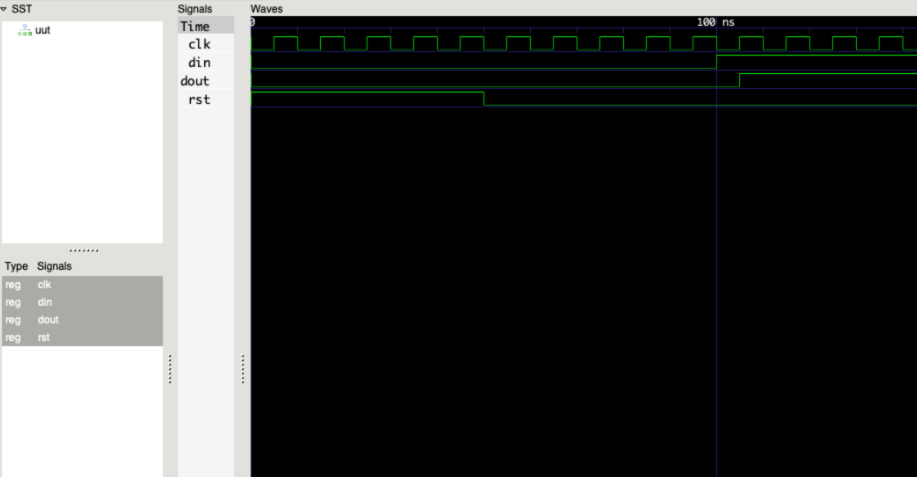

## Lab 1 - GHDL and GTKWave  

### Half Adder  
```bash  
ghdl -a ha.vhdl  
ghdl -a ha_tb.vhdl  
ghdl -e ha_tb  
ghdl -r ha_tb --vcd=ha.vcd  
gtkwave ha.vcd  
```
 

### Full Adder  
```bash  
ghdl -a adder.vhdl  
ghdl -a adder_tb.vhdl  
ghdl -e adder_tb  
ghdl -r adder_tb --vcd=adder.vcd  
gtkwave adder.vcd  
```
 

### D Flip-Flop  
```bash  
ghdl -a dff.vhdl  
ghdl -a dff_tb.vhdl  
ghdl -e dff_tb  
ghdl -r dff_tb --vcd=dff.vcd  
gtkwave dff.vcd  
```
 

### Notes  
- Install **GHDL** and **GTKWave**.  
- Document results with screenshots and code.
