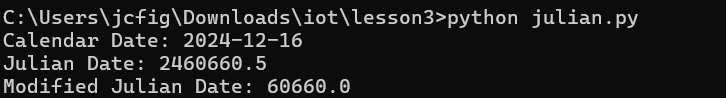
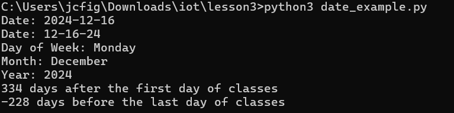
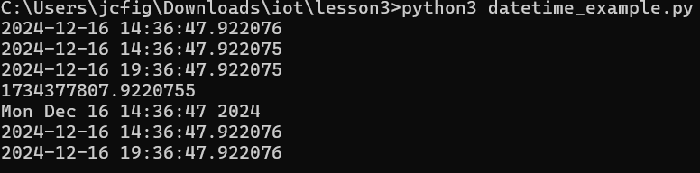
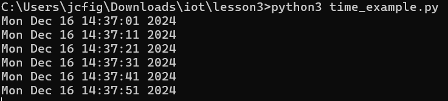

# Lab 3  

---  
## **Python Scripts Lab**  

This lab explores executing Python scripts in a Linux environment, focusing on modules like `jdcal`, `astral`, and `geopy`, along with hands-on practice using scripts to calculate dates, manage time, and retrieve geographical and system information.  

---  

### **Commands and Outputs**  

1. **`python3 julian.py`**  
   - Executes the `julian.py` script, which works with Julian dates for date calculations.
   -   

2. **`python3 date_example.py`**  
   - Runs a script demonstrating date manipulation and formatting.
   -   

3. **`python3 datetime_example.py`**  
   - Executes a script showcasing the `datetime` module for advanced date and time operations.
   - 

4. **`python3 time_example.py`**  
   - Runs a script highlighting the `time` module for operations such as timestamps.
   - 
     
5. **`python3 sun.py "New York"`**  
   - Retrieves sunrise and sunset times for New York using the `astral` module.  
   -   

6. **`python3 moon.py`**  
   - Calculates moon phase information using astronomical data.
   - 

7. **`python3 coordinates.py "Samuel C. Williams Library"`**  
   - Retrieves geographical coordinates for the given address using the `geopy` library.
   -   

8. **`python3 address.py "40.74480675, -74.02532861159351"`**  
    - Converts latitude and longitude into a human-readable address.
    - 

9. **`python3 cpu.py`**  
    - Displays information about the system's CPU.
    - 

10. **`python3 battery.py`**  
    - Checks and displays the system's battery status.
    - 

11. **`python3 documentstats.py document.txt`**  
    - Analyzes and displays statistics (word count, line count, etc.) for the given text document.
    - 

---  

## **Modules and Tools Used in the Lab**  

1. **`jdcal`**  
   - A Python library for Julian date calculations.  

2. **`astral`**  
   - Provides information about astronomical events like sunrise, sunset, and moon phases.  

3. **`geopy`**  
   - A library for geocoding and geographical operations, such as finding coordinates or addresses.  

4. **System Utilities**  
   - Scripts like `cpu.py` and `battery.py` utilize Python's standard and external libraries to fetch system information.  
