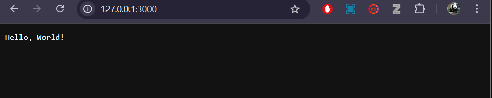
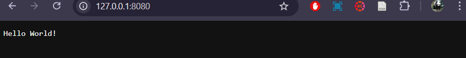
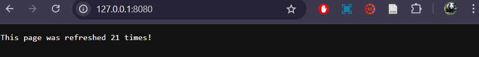
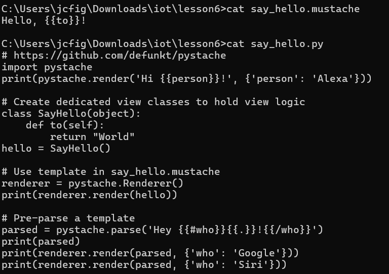

# **Lab 6: Node.js and Pystache**

## **Procedure**

### **1. Study Lesson 6**
- Review the concepts related to server-side development with **Node.js** and templating using **Pystache**.

Run the scripts:
```bash
node hello-world.js
node hello.js
node http.js
```

### **Node.js**
- **hello-world.js**  
  Output:  
   

- **hello.js**  
  Output:  
   

- **http.js**  
  Output:  
   

### **Pystache**
- **say_hello.py**  
  Output:  
   

---

## **Things Learned**
1. **Understanding server-side JavaScript development with Node.js**.  
2. **How to use Pystache for templating in Python applications**.  
3. **Basic web server creation and interaction using HTTP in Node.js**.
